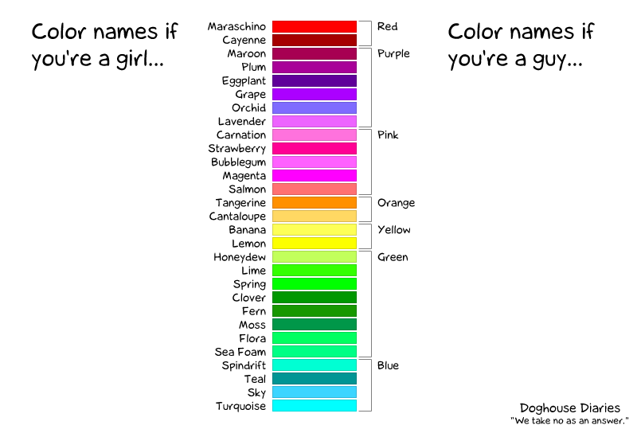
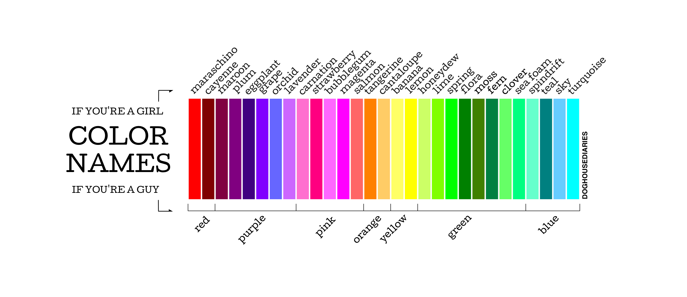
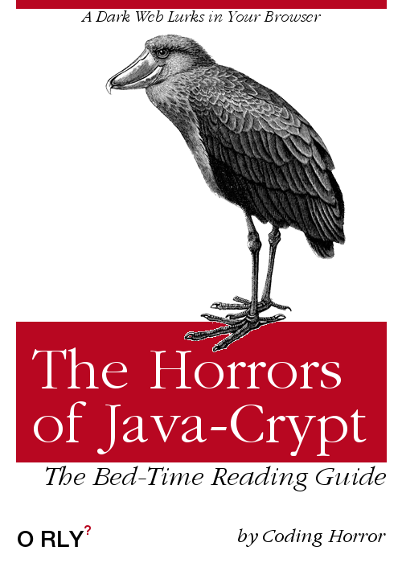
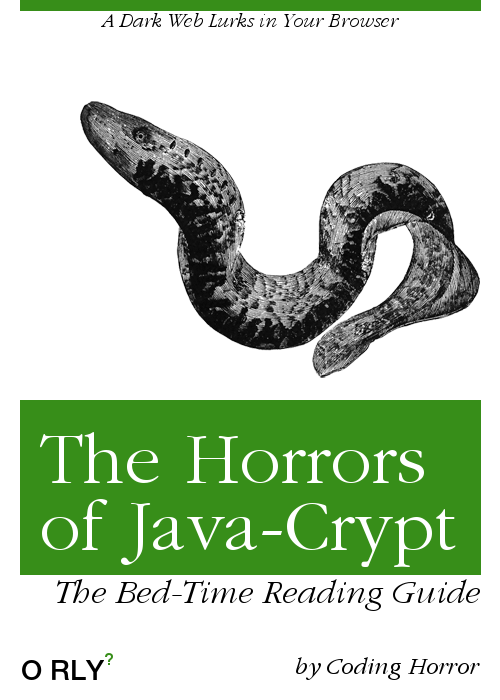
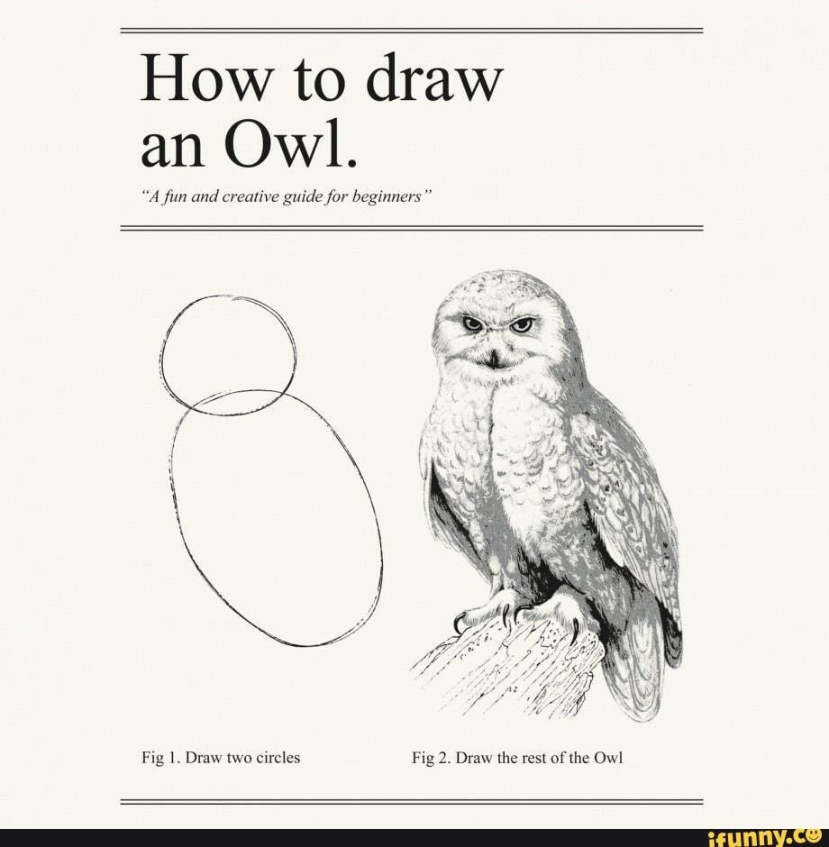
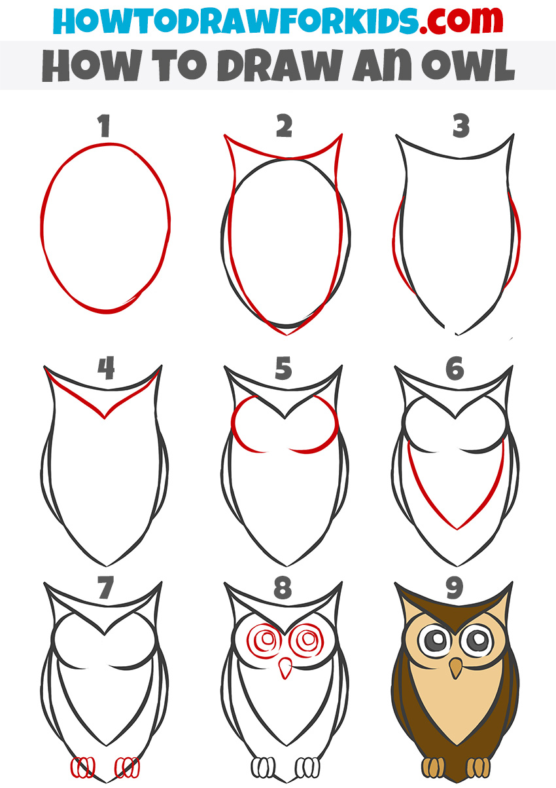

# Image Credits

> This is a partial list of the credits for images in this workbook.

| Description | Credits | Images |
|-------------|---------|--------|
| **Color Names - vertical** | [http://www.thedoghousediaries.com/1406](http://www.thedoghousediaries.com/1406) |  |
| **Color Names** | *uncertain* |  |
| **Horrors of JavaCrypt** | [O RLY Cover Generator](https://dev.to/rly) |  |
| **Horrors of JavaCrypt 2** | [O RLY Cover Generator](https://dev.to/rly) |  |
| **Draw an Owl meme**  | [https://ifunny.co/picture/how-to-draw-an-owl-how-to-draw-an-owl-37E5R5TE9](https://ifunny.co/picture/how-to-draw-an-owl-how-to-draw-an-owl-37E5R5TE9) (with adaptations) |  
| **How to Draw an Owl** | [How to Draw an Owl for Kids](https://howtodrawforkids.com/wp-content/uploads/2021/10/how-to-draw-an-owl-for-kids.jpg) |  |

----

## Copyrighted Images

> Scuba Image licensed to *Dan Gilleland* through Presenter Media - Used for educational purposes (*'cause it creates interest*). If you wish to re-use this in your own projects, please purchase your own [License](https://www.presentermedia.com/eula.html) through [**Presenter Media**](https://www.presentermedia.com/).