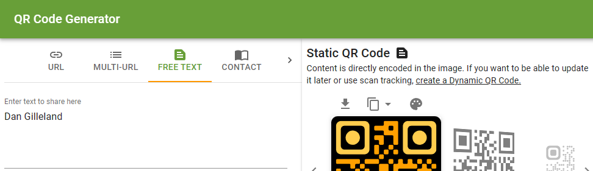

# More Markdown - Keeping Organized 

> :black_nib: Remember to jot down thing's you've learned from this walkthrough in your [Journal](../../docs/mynotes/Journal.md).

The goal of this lesson is to show you how to organize your markdown content so that it is "rich" in value, containing images and links to other documentation in your repository.

1. Download an image from the MS Teams chat, and place it in the [`docs\mynotes\images`](../../docs/mynotes/images/) folder. Make an entry in your Journal in which you demonstrate referencing that image in Markdown. Also include a fenced code block in your journal showing the markdown code used to reference that image.
1. Create a [QR Code of your name](https://www.the-qrcode-generator.com/) and save it as an image to the [`docs\images`](../../docs/images/) folder. In the **ReadMe** at the root of your repository, add that image in a separate line just below your name.
1. Edit the [`src\ReadMe.md`](../../src/ReadMe.md) document to add a table for each week of classes. In here, you will place links to each of the lessons' **ReadMe** files under the `src` folder. As you create the markdown links, be sure to use **relative paths** when linking to items inside your repository.
1. Move the `Markdown.md` and `git+VSCode.md` files from this lesson to place them in the `mynotes/` folder of your repository. Add appropriate links for `mynotes/ReadMe.md` to these files.
1. Commit these changes to your repository and synchronize it with the copy on GitHub. View these pages on GitHub to see how the links appear.

Feel free to augment any of these markdown files with additional information that you have learned in class.

