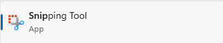
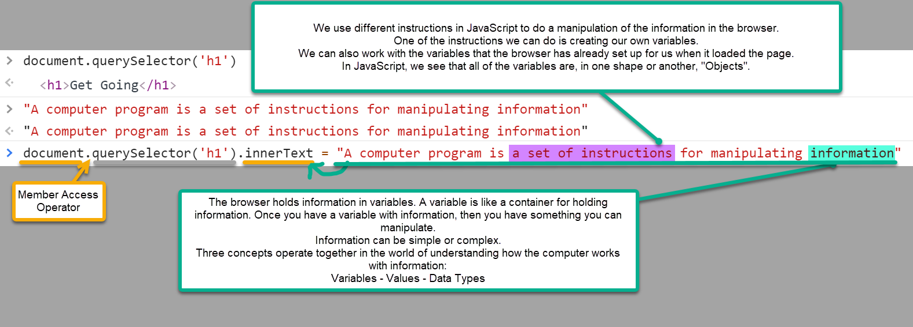
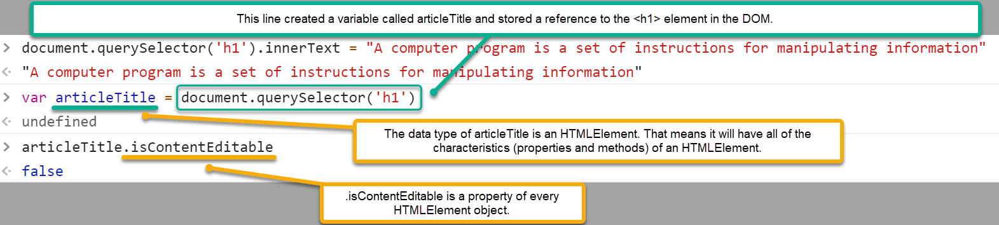

# JavaScript in the Browser 

> Are you keeping up with your Journal? Consider making a separate markdown file for a *glossary of terms* (`glossary.md`) that you can refer to later on.

## Learn to Think in Terms of *Objects*

The focus of this lesson is on using the Developer Tools in the browser. A web browser is a tool used to render and interact with **web pages**. It offers a rich set of pre-defined objects as part of its **rendering engine**. The objects are part of the **DOM API**.

When a web browser renders a web page, it creates a **Document Object Model** (DOM) that represents the contents of the page. The DOM is a **hierarchical** structure, meaning that it is made up of **nodes** that are connected to each other in a parent-child relationship. The DOM is a **live** structure, meaning that it is constantly changing as the user interacts with the web page.

When you open the Developer Tools in your browser, you are given access to the **console**. The console is a place where you can interact with the browser's rendering engine. You can use it to inspect the **DOM** and to run JavaScript code.

----

## Live-Demo Walkthrough

Before beginning this walkthrough, you should know how to take screenshots. One free tool available for this is [**TechSmith Capture**](https://www.techsmith.com/jing-tool.html) (formerly named "Jing", by the makers of *SnagIt*). Another is the [**Snipping Tool**](https://support.microsoft.com/en-us/windows/use-snipping-tool-to-capture-screenshots-00246869-1843-655f-f220-97299b865f6b) tool built into Windows 10/11.

| Snipping Tool | TechSmith Capture |
| :---: | :---: |
|  |  |

> **Note:** Lessons will occasionally have [References](#references) at the end of the document. These include credit notices and additional resources/readings related to topics in this lesson.

1. Open your web browser and navigate to any website. (The contents of the website are irrelevant to this walkthrough.)
1. Open the browser's Developer Tools and select the console. In here, you will be entering JavaScript code as directed by your instructor.
1. Take screen-shots of your own work in the console to demonstrate your use of the console in the browser. Place those images in this folder and edit this document to show those images below.
1. Commit these changes to your repository and synchronize it with the copy on GitHub.

   *This is the last time you will be explicitly asked to commit your changes and synchronize with GitHub. At this point, **you will be expected to [make your own commits on a regular basis](../../docs/TheRoutine.md) for each lesson**.*

----

> *[Images Here]*

----

## Practice

Work on the [practice exercise](./practice/ReadMe.md) for this demo. When you are done, make notes in your journal about what you learned. Also, make note of any questions you may have about the material presented and practice exercise.

----

## HTML/CSS Review

> ***Note: This portion is a self-study topic!** You should consider reading the MDN documentation on [HTML basics](https://developer.mozilla.org/docs/Learn/Getting_started_with_the_web/HTML_basics) and [CSS basics](https://developer.mozilla.org/docs/Learn/Getting_started_with_the_web/CSS_basics) as well as the article on [dealing with files](https://developer.mozilla.org/docs/Learn/Getting_started_with_the_web/Dealing_with_files) as a refresher on material you are expected to know **prior** to taking this course.*

*Prior to beginning this course, you should be able to...*

- Describe the purpose of the `<head>` and `<body>` elements in HTML
- List and describe the purpose of the most common elements in the `<head>` element
- List and describe the purpose of at least 15 of the most common elements in the `<body>` element
- Identify the semantic purpose of the following elements: `<header>`, `<footer>`, `<nav>`, `<section>`, `<article>`, `<aside>`, `<main>`, `<figure>`, `<figcaption>`, `
`, `
`, `<blockquote>`, `<q>`
- Identify the three primary types of CSS selectors used in a `.css` file
- Design the look and feel of a web page using CSS

----

## References

- [TechSmith Capture Tutorial](https://www.techsmith.com/tutorial-capture.html)
- [JavaScript Spec (ES5 vs ES6 vs ES7)](https://developer.mozilla.org/en-US/docs/Web/JavaScript/Language_Resources)
- Complete Beginner's Introduction to [JavaScript](https://developer.mozilla.org/en-US/docs/Web/JavaScript)
  - [JavaScript basics](https://developer.mozilla.org/en-US/docs/Learn/Getting_started_with_the_web/JavaScript_basics)
  - [JavaScript first steps](https://developer.mozilla.org/en-US/docs/Learn/JavaScript/First_steps)
  - [JavaScript building blocks](https://developer.mozilla.org/en-US/docs/Learn/JavaScript/Building_blocks)
  - [Introducing JavaScript Objects](https://developer.mozilla.org/en-US/docs/Learn/JavaScript/Objects)

----

## Have You Reviewed Today's Lessons?

See what [**Stewart**](https://github.com/StewDent) created as a [live-demo](./live-demo/index.html) for working with JavaScript in the Browser. He also added some notes and screenshots in the *docs* folder of his repository:

> ### Retrospective: JavaScript in the Browser
> 
> We learned about the DOM (*Document Object Model*) and how to access/manipulate it using JavaScript.
> 
> 
> 
> We also learned about creating our own variables in JavaScript, and that we can get a "reference" to an item/element in the DOM.
> 
> 