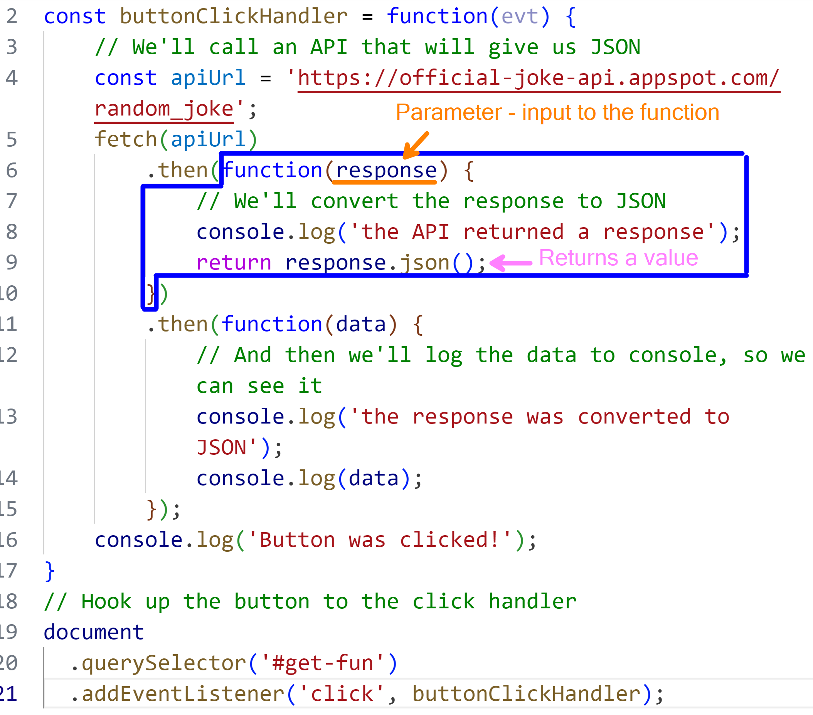
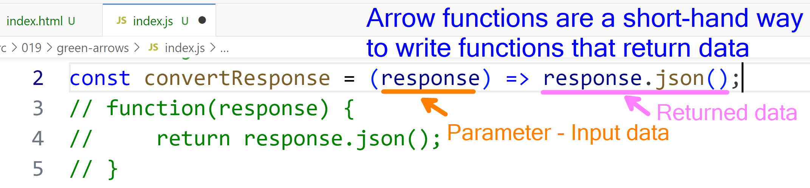

# Building On JSON

## Lesson Notes

### Arrow Functions

| Before Refactoring | After Refactoring |
| --- | --- |
| ```function (x) { return x * x; }``` | ```x => x * x``` |
| ```function (x, y) { return x * y; }``` | ```(x, y) => x * y``` |
| ```function () { return 42; }``` | ```() => 42``` |
| ```function (x) { return { value: x }; }``` | ```x => ({ value: x })``` |
|  |  |

- [ ] Extras
  - [ ] Discuss JSONC (and note the [support in VS Code](https://code.visualstudio.com/Docs/languages/json#_json-with-comments); see also [this article](https://www.techiediaries.com/enable-json-comments-vs-code/)) and [JSON5](https://json5.org/); review points of [**this article**](https://tuantran92.id.vn/comparison-of-json-and-json5/) 
  - [ ] Discuss [JSONL](https://jsonlines.org/) and review [**this article**](https://www.atatus.com/glossary/jsonl/)